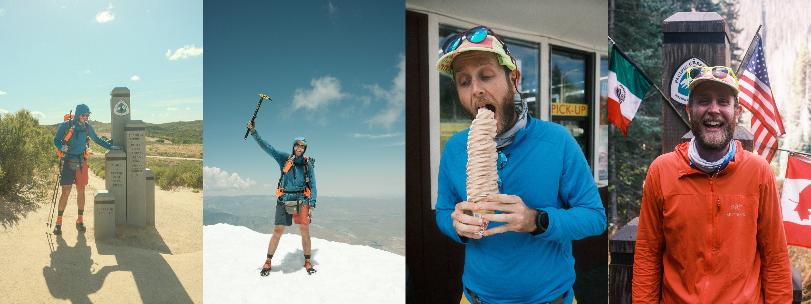

```{r}
#| label: library
#| include: false
library(tidyverse)
library(knitr)
library(colorspace)
library(naniar)
library(visdat)
```


```{r}
#| label: source-r-files
#| echo: false
#| message: false
#| output: false
lapply(list.files(here::here("R"), full.names = TRUE), source)
```

```{r}
#| label: helpers
#| include: false

theme_set(
  theme_grey(base_size = 16) +
  theme(
    legend.position = "bottom",
    plot.background = element_rect(fill = "transparent"),
    legend.background = element_rect(fill = "transparent")
  )
)

# **ni**ck's **pa**lette
nipa <- list(red = "#c03018",
             orange = "#f0a800",
             green = "#609048",
             purple = "#484878",
             light_purple = "#A3A3BB",
             light_green = "#AFC7A3",
             light_orange = "#F7D37F",
             light_red = "#DF978B",
             pale_purple = "#ECECF1",
             pale_green = "#D7E3D1",
             pale_orange = "#FBE9BF",
             pale_red = "#EFCBC4")

```

::: {.notes}

To build a sustainable consulting practice, I think you need a genuine value-add to the wider community. I am not convinced writing a post such as "10 things you need to do now to improve your data visualisations" cuts it. Teaching does. And more, I think you should share your course materials for free.

In this talk I will argue teaching and openly sharing your materials is a sustainable business model. The value learners pay for when they attend a course is not the slides or the code, those should be freely available online. The value they get, which they are paying for, is time with the instructor, and the commitment they make to carving out space to learn something new.

Developing free and open content compounds over time. It creates a living document you can refer to and update. It demonstrates your expertise not by telling people you know things, but by showing them. It surfaces your work to learners who would never have found you otherwise, and those learners become the pipeline for future consulting and collaboration. It also deepens your own understanding of the topic. So, you get professional development built in.

I will discuss a case study in R training: _Quarto for Scientists_ to illustrate how this works in practice. I hope to leave attendees with the conviction that creating useful, openly available learning content is not a distraction from building a consulting practice, but is a highly effective way to build, and sustain one.

:::


# This next slide is an image

##  {background-image="images/IMAGE.png" background-size="contain"}


# Take homes

# Future Directions

::: {.fragment .fade-up}
- More features
- More features
- More features
:::

# Test

# Thanks


:::: {.columns}

::: {.column width = "40%"}

- So many great people
- So many great people
- So many great people
- So many great people

:::

::: {.column width = "40%"}

- So many great people
- So many great people
- So many great people
- So many great people

:::

::::

# Resources

- So many things
- So many things
- So many things
- So many things

# Colophon

- Slides made using [quarto](https://github.com/quarto-dev/quarto)
- Colours taken + modified from [lorikeet theme from ochRe](https://github.com/ropenscilabs/ochRe)
[njtierney/njt-talks](github.com/njtierney/njt-talks)
<!-- - Header font is **Josefin Sans** -->
<!-- - Body text font is **Montserrat** -->
<!-- - Code font is **Fira Mono** -->
<!-- - template available:  -->

# Learning more

- **talk link** [talk link]()

- **github** `@njtierney`

- **email** nicholas.tierney@gmail.com

# **End.**

# Extras

# ❤️ Hiking! `njt.micro.blog`

{background-size="75%"}
